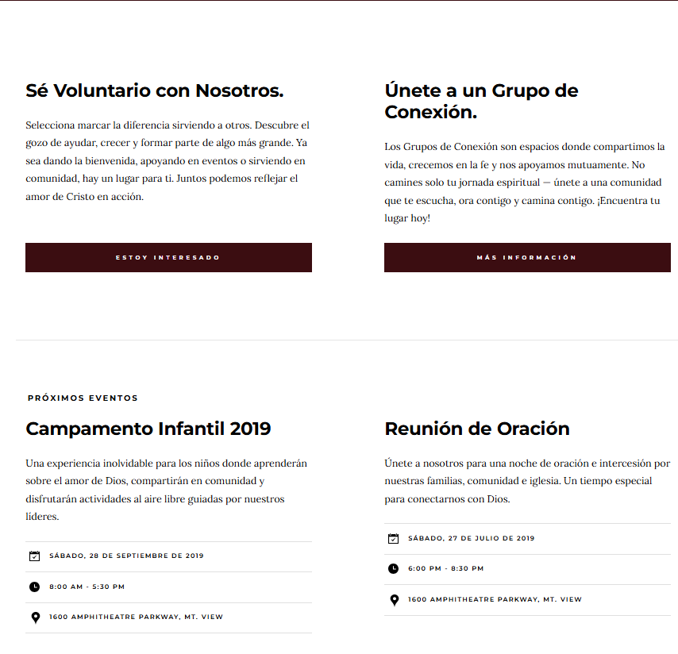

# ChurchSite_static  

  
[🚀 Ver demo de ChurchSite_static](https://jose-daniel-g.github.io/ChurchSite_static/)  
**URL:** [https://jose-daniel-g.github.io/ChurchSite_static/](https://jose-daniel-g.github.io/ChurchSite_static/)  

---

## 📸 Screenshots  

| Frontend (Vista adicional) | Frontend (Vista en teléfono) |
|----------------------------|------------------------------|
|  |  |

| Vista principal del proyecto |
|------------------------------|
|  |

---

## 📚 Fuentes y Créditos  

**Fonts:**  
- [Lora](https://fonts.google.com/specimen/Lora)  
- [Montserrat](https://fonts.google.com/specimen/Montserrat)  
- [Open Sans](https://fonts.google.com/specimen/Open+Sans)  

**Icons:**  
- [Iconmonstr](https://iconmonstr.com/)  

**Stock Photos and Graphics:**  
- [Unsplash](https://unsplash.com/)  

**Javascript Libraries:**  
- [jQuery](http://jquery.com/)  
- [Modernizr](http://modernizr.com/)  
- [Parallax.js](http://pixelcog.github.io/parallax.js/)  

---
